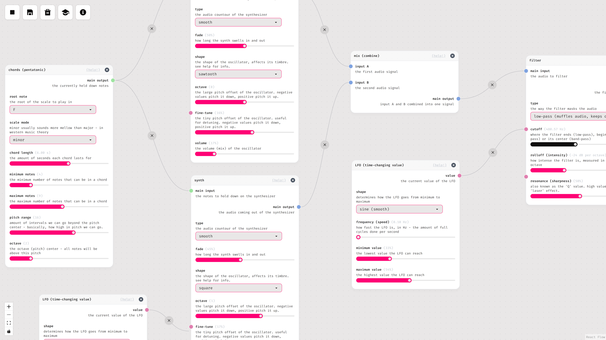

# Vestige
Vestige is a generative music synthesizer, designed to create autonomous compositions. It works by providing the user with a few basic modules that may be connected together to form a wide variety of different sounds. It's designed to be approachable and easy to understand.

<h6 align="center">click on the screenshot above to watch a demo video!</h6>

## ✨ Features
- algorithmic melody/chord generation,
- built-in instruments:
    - subtractive synthesis,
    - sampler (ROMpler),
    - step/drum sequencer (with built-in sounds),
- effects:
    - filters (low-pass, band-pass, high-pass),
    - reverb,
    - shimmer reverb,
    - delay (echo),
    - chorus,
    - phaser,
    - stereo widener,
- LFOs and value automation,
- offline rendering,
- simple, easy-to-understand workflow.

## 🌍 Building for web
In order to build the project, use `npm run build`. The resulting web app will be placed in the `dist` directory. You can also use `npm run dev` in order to create a development build that you can access via `localhost`.

## 💻 Building for desktop
Vestige uses Tauri in order to run as a standalone desktop app. Use `npx tauri build` in order to build the app alongside its installers. Similarly to the web build, you can also use `npx tauri dev` to create a development build.